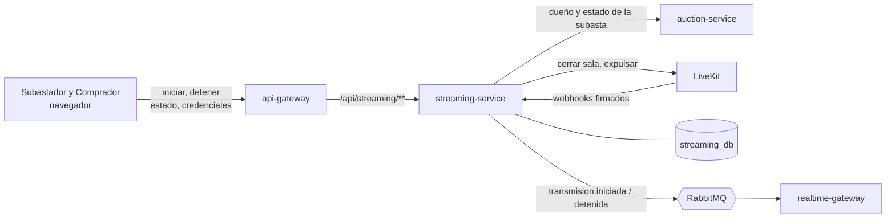
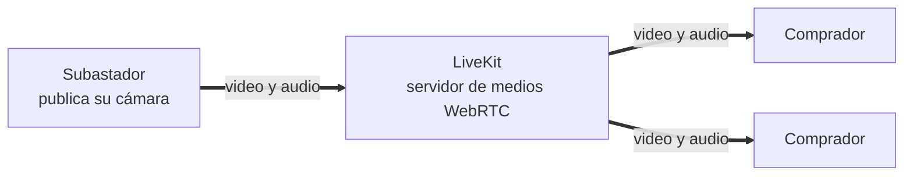
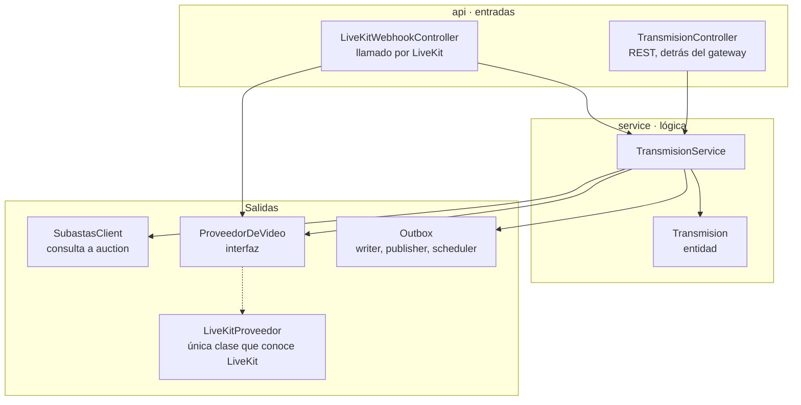
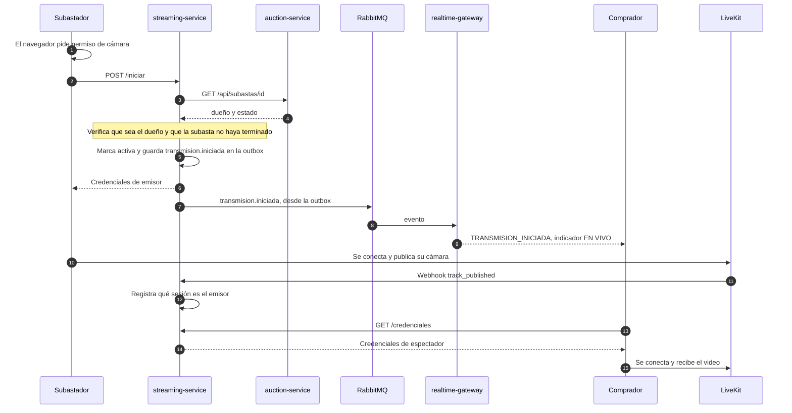
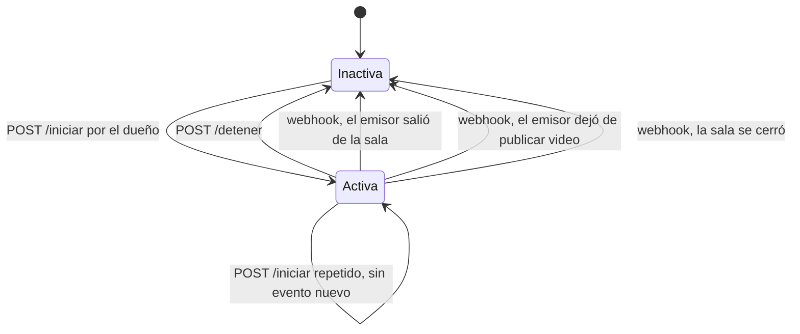
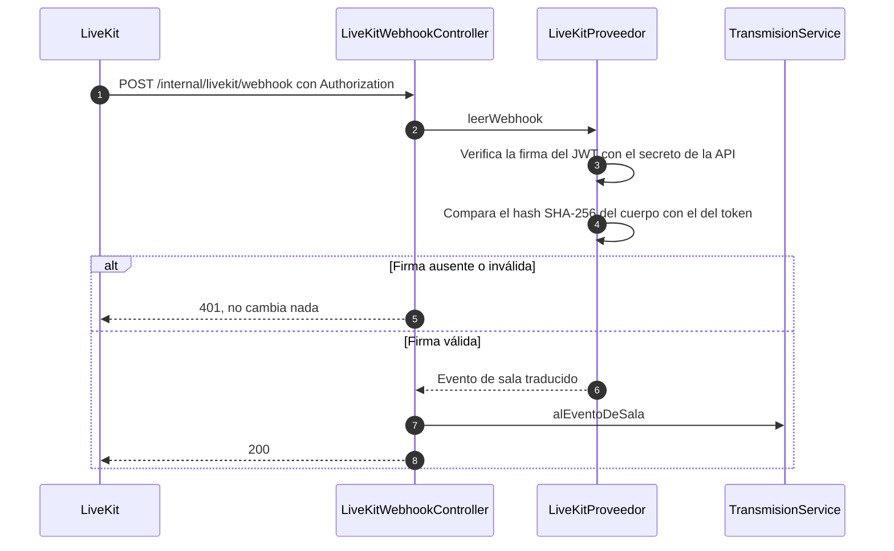
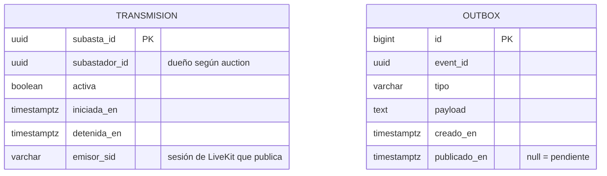
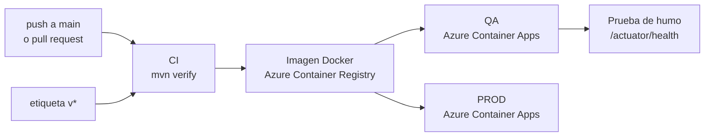

# cafeorbe-streaming-service

> Señalización del video en vivo. Decide quién puede transmitir y quién puede mirar, y mantiene el estado "hay transmisión". El video en sí nunca pasa por aquí: lo mueve LiveKit por WebRTC.

| | |
|---|---|
| **Responsabilidad** | Autorizar la transmisión, entregar credenciales de video y reflejar su estado |
| **Estilo interno** | Servicio delgado de integración, con un adaptador hacia el proveedor de video |
| **Stack** | Java 21 · Spring Boot 3.5 · Spring Data JPA · Flyway · JJWT · RabbitMQ |
| **Persistencia** | PostgreSQL, base propia `streaming_db` |
| **Puerto** | `8084` |
| **Historias** | HU-11 y la base de HU-15 |
| **Publica** | `transmision.iniciada`, `transmision.detenida` |
| **Depende de** | auction-service (dueño y estado de la subasta) y LiveKit |

## Contenido

1. [Contexto](#1-contexto)
2. [Arquitectura interna](#2-arquitectura-interna)
3. [Contrato de la API](#3-contrato-de-la-api)
4. [Flujo: iniciar y ver la transmisión](#4-flujo-iniciar-y-ver-la-transmisión)
5. [Ciclo de vida de la transmisión](#5-ciclo-de-vida-de-la-transmisión)
6. [Credenciales y permisos](#6-credenciales-y-permisos)
7. [Webhooks de LiveKit](#7-webhooks-de-livekit)
8. [Modelo de datos](#8-modelo-de-datos)
9. [Decisiones de arquitectura](#9-decisiones-de-arquitectura)
10. [Atributos de calidad](#10-atributos-de-calidad)
11. [Configuración](#11-configuración)
12. [Ejecución y pruebas](#12-ejecución-y-pruebas)
13. [Despliegue](#13-despliegue)
14. [Riesgos conocidos y evolución](#14-riesgos-conocidos-y-evolución)

---

## 1. Contexto

Hay dos planos separados. El **plano de control** (quién puede hacer qué, qué estado hay) pasa por este servicio. El **plano de medios** (audio y video) va directo del navegador a LiveKit.

**Plano de control**



**Plano de medios**



El streaming-service no aparece en el segundo diagrama: su carga no depende de cuántos espectadores haya.

## 2. Arquitectura interna



| Paquete | Función |
|---|---|
| `api` | Endpoints REST, webhook, identidad desde cabeceras y errores uniformes |
| `service` | Reglas de la transmisión: quién puede iniciar, detener y mirar |
| `client` | Consulta a auction-service |
| `provider` | Adaptador del proveedor de video |
| `outbox` | Publicación confiable de eventos |

**El punto de diseño central es `ProveedorDeVideo`.** El resto del servicio no sabe que existe LiveKit: solo conoce "credenciales de emisor", "credenciales de espectador", "cerrar sala" y "evento de sala". Cambiar de proveedor es escribir otra implementación de esa interfaz.

## 3. Contrato de la API

Rutas bajo `/api/streaming/subastas/{subastaId}`, detrás del gateway.

| Método y ruta | Quién | Respuesta |
|---|---|---|
| `POST /iniciar` | Subastador dueño de la subasta | Credenciales de emisor `{ url, token, sala }`. Idempotente: si ya estaba activa no repite el evento |
| `POST /detener` | Subastador que la inició | `{ transmitiendo: false, sala }` |
| `GET /estado` | Cualquier usuario autenticado | `{ transmitiendo, sala }` |
| `GET /credenciales` | Cualquier usuario autenticado | Credenciales de solo lectura. `409` si no hay transmisión |

Ruta fuera del gateway: `POST /internal/livekit/webhook`, llamada por LiveKit.

| HTTP | Cuándo | Mensaje |
|:-:|---|---|
| `401` | Sin identidad, o webhook sin firma válida | Sesión requerida |
| `403` | No es Subastador | No autorizado |
| `403` | La subasta es de otro Subastador | Solo el Subastador de esta subasta puede transmitir |
| `404` | La subasta no existe | La subasta no existe |
| `409` | La subasta ya terminó | La subasta ya terminó; no se puede transmitir |
| `409` | Se piden credenciales sin transmisión | La transmisión aún no ha iniciado |
| `503` | auction-service no responde | No se pudo verificar la subasta, intenta de nuevo |

**Nunca se transmite sin verificar:** si auction no responde, el servicio prefiere negar la transmisión antes que permitirla a ciegas.

## 4. Flujo: iniciar y ver la transmisión



El permiso de cámara se pide **antes** de llamar al servicio. Si el navegador lo niega, no se cambia ningún estado ni se avisa a nadie.

## 5. Ciclo de vida de la transmisión



Toda transición a `Inactiva` hace lo mismo: guarda `transmision.detenida` en la outbox y, una vez confirmada la transacción, cierra la sala en LiveKit. Los compradores ven "Transmisión finalizada".

El caso que justifica los webhooks: **el Subastador cierra la pestaña o pierde la conexión**. Nadie llama a `/detener`, pero LiveKit avisa que el participante salió y el servidor detiene la transmisión por su cuenta. Sin esto, los compradores verían EN VIVO con la pantalla en negro.

## 6. Credenciales y permisos

Las credenciales son un token de acceso de LiveKit: un JWT firmado con HS256 con el secreto de la API, generado sin usar el SDK de LiveKit.

| | Emisor (Subastador) | Espectador (Comprador) |
|---|:-:|:-:|
| Entrar a la sala `subasta-{id}` | Sí | Sí |
| Publicar video y audio | **Sí** | No |
| Recibir video y audio | Sí | Sí |
| Enviar datos | No | No |
| Vigencia | 120 min | 120 min |

Cada token está limitado a **una sola sala**. El permiso de publicar lo decide este servicio al firmar; LiveKit lo hace cumplir.

## 7. Webhooks de LiveKit

LiveKit llama directo a este servicio, sin pasar por el api-gateway, así que no hay usuario ni token de sesión. La petición se acepta **solo si viene firmada**.



| Evento de LiveKit | Reacción |
|---|---|
| `track_published` del dueño con transmisión activa | Registra su sesión como el emisor |
| `track_published` de cualquier otro | Lo **expulsa** de la sala: alguien publicó sin una transmisión activa suya, por ejemplo con un token viejo |
| `track_unpublished` del video del emisor | Detiene la transmisión |
| `participant_left` del emisor | Detiene la transmisión |
| `room_finished` | Detiene la transmisión si seguía activa |

El servicio guarda la **sesión** del emisor, no solo su usuario: si el Subastador reconecta, la salida de su sesión vieja no corta la transmisión nueva.

## 8. Modelo de datos



Una fila por subasta. El servicio **no guarda subastas**: auction-service es la única fuente de verdad sobre el dueño y el estado, y se consulta en cada inicio. El esquema lo gestiona Flyway; Hibernate solo valida.

## 9. Decisiones de arquitectura

| Decisión | Motivo | Costo aceptado |
|---|---|---|
| Servidor de medios externo (LiveKit) | Transportar video en tiempo real es un problema resuelto y costoso de operar; no aporta valor construirlo | Dependencia de un proveedor |
| Adaptador único `ProveedorDeVideo` | El proveedor se puede cambiar sin tocar las reglas | Una capa de traducción para webhooks y credenciales |
| Firmar los tokens sin el SDK de LiveKit | El token es un JWT estándar; se evita una dependencia pesada para tres operaciones | Hay que seguir el formato del proveedor a mano |
| Consultar a auction en cada inicio, sin copia local | Una sola fuente de verdad; no hay que sincronizar subastas por eventos | Acoplamiento temporal con auction al iniciar |
| Negar la transmisión si auction no responde | Preferir seguridad sobre disponibilidad: nadie transmite en una subasta ajena por una falla | El Subastador debe reintentar |
| Outbox transaccional | El estado y su evento no pueden divergir; si el broker cae, el evento espera | Latencia de hasta 200 ms |
| Llamadas a LiveKit después de confirmar la transacción | No se cierra una sala por un cambio que luego se revierte, ni se sostiene una transacción durante una llamada externa | Si LiveKit falla, solo queda un aviso en el log |
| Detención desde el servidor por webhooks | El estado no depende de que el navegador se despida bien | Requiere que LiveKit alcance a este servicio |

## 10. Atributos de calidad

| Atributo | Cómo se logra |
|---|---|
| **Seguridad** | Solo el dueño transmite; tokens con el mínimo permiso y limitados a una sala; webhooks autenticados por firma y hash del cuerpo |
| **Consistencia** | El indicador EN VIVO refleja lo que pasa en la sala de video, incluso si el emisor desaparece |
| **Resiliencia** | Un fallo de LiveKit al cerrar la sala no bloquea al usuario. Un 404 de LiveKit se trata como éxito: la sala ya no existía |
| **Rendimiento** | El servicio no toca el video: su carga no crece con la cantidad de espectadores |
| **Portabilidad** | Proveedor de video aislado detrás de una interfaz |

## 11. Configuración

| Variable | Por defecto | Uso |
|---|---|---|
| `DB_URL` `DB_USER` `DB_PASSWORD` | `jdbc:postgresql://localhost:5432/streaming_db` | Base de datos propia |
| `RABBIT_HOST` `RABBIT_PORT` `RABBIT_USER` `RABBIT_PASSWORD` | `localhost:5672` | Broker de eventos |
| `RABBIT_VHOST` `RABBIT_SSL` | `/` · `false` | Broker gestionado con TLS |
| `AUCTION_URL` | `http://localhost:8082` | Consulta del dueño y el estado de la subasta |
| `LIVEKIT_URL` | `ws://localhost:7880` | URL a la que se conecta el **navegador** |
| `LIVEKIT_API_URL` | `http://localhost:7880` | API de servidor de LiveKit vista **desde este servicio** |
| `LIVEKIT_API_KEY` `LIVEKIT_API_SECRET` | valores de desarrollo | Firma de tokens y verificación de webhooks |

`LIVEKIT_URL` y `LIVEKIT_API_URL` son distintas a propósito: la primera debe ser alcanzable desde el navegador del usuario y la segunda desde el servidor. En Docker local son `ws://localhost:7880` y `http://livekit:7880`.

## 12. Ejecución y pruebas

Requiere **Java 21** y el módulo `cafeorbe-contracts` instalado (`mvn install` en ese repositorio).

```bash
mvn spring-boot:run      # necesita Postgres, RabbitMQ, auction-service y LiveKit: ver cafeorbe-infra
mvn test                 # 19 pruebas con H2 en memoria: no necesita infraestructura ni LiveKit
```

| Suite | Pruebas | Qué verifica |
|---|:-:|---|
| `TransmisionTest` | 16 | Inicio, detención, permisos, contenido de los tokens, outbox, webhooks firmados y expulsión |
| `SubastasClientTest` | 3 | La consulta a auction: respuesta normal, subasta inexistente y servicio caído |

**Lo que las pruebas automáticas no cubren:** el video real y el permiso de cámara dependen del navegador y de LiveKit. Los tres escenarios de HU-11 requieren una prueba manual con dos navegadores, emisor y receptor a la vez.

## 13. Despliegue



El pipeline (`.github/workflows/ci.yml`) despliega en QA con cada cambio en `main` y en PROD con una etiqueta `v*`. En Azure el proveedor de video es LiveKit Cloud; en local, un contenedor de LiveKit definido en `cafeorbe-infra`.

## 14. Riesgos conocidos y evolución

| Riesgo o deuda | Impacto | Acción propuesta |
|---|---|---|
| El pipeline no define `LIVEKIT_API_URL` | En Azure el servicio usaría el valor por defecto (`localhost`): cerrar salas y expulsar participantes fallaría en silencio, solo con un aviso en el log | Agregar la variable con la URL de la API de LiveKit Cloud |
| El webhook debe estar configurado en LiveKit Cloud | Sin él, cerrar la pestaña deja la transmisión como activa | Registrar la URL pública de `/internal/livekit/webhook` en el proyecto de LiveKit y verificarlo |
| El webhook obliga a que el servicio sea alcanzable desde internet | El resto de sus rutas confía en las cabeceras `X-User-*`, así que no debería ser público | Exponer solo `/internal/livekit/webhook`; ver `cafeorbe-infra`, riesgos 2 y 3 |
| En la nube, `AUCTION_URL` usa `http` hacia un nombre interno | Por verificar: el ambiente redirige a `https` y el cliente no sigue la redirección, así que iniciar la transmisión respondería `503` | Probar en QA; ver `cafeorbe-infra`, riesgo 5 |
| El token del emisor dura 120 min | Tras detener, sigue siendo válido; se mitiga cerrando la sala y expulsando a quien republique | Tokens de vida más corta |
| Prueba manual de video pendiente | No hay evidencia de los escenarios de HU-11 con cámara real | Ejecutarla con dos navegadores antes de la demo |
| QA y PROD comparten base de datos y broker en el pipeline | Estados de transmisión mezclados entre ambientes | Separar bases y vhost por ambiente |
| La outbox no se purga | La tabla crece indefinidamente | Limpieza de eventos ya publicados |

**Sprint 2:** HU-15 completa la experiencia del Comprador (reproductor y conteo de conectados). El backend de video ya está: `GET /estado` y `GET /credenciales` son los que usa.
